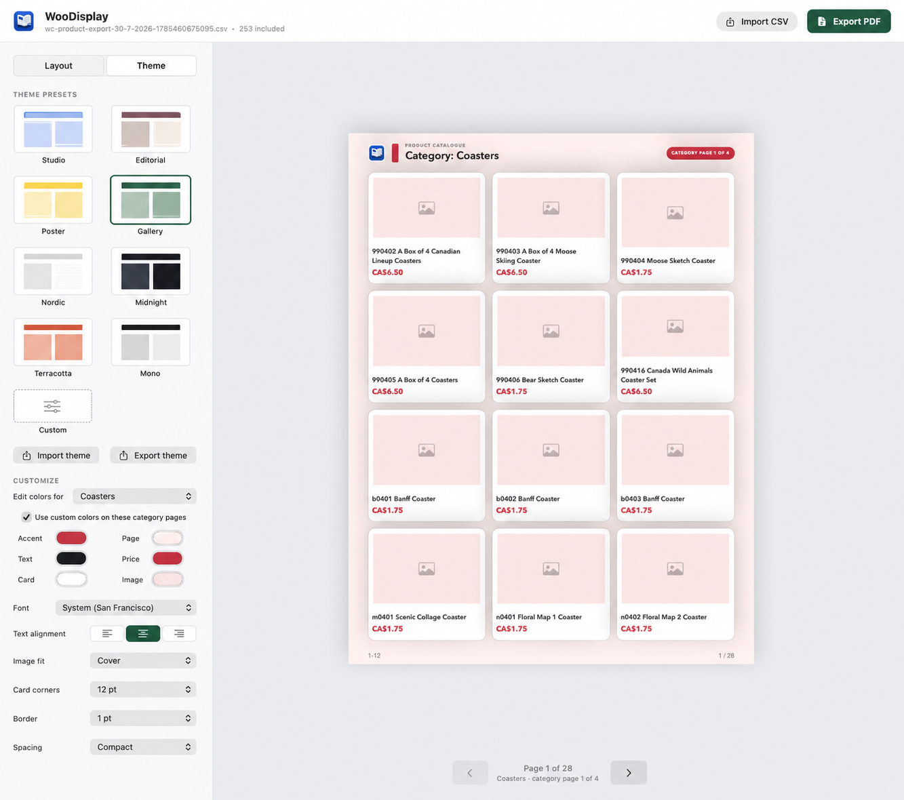
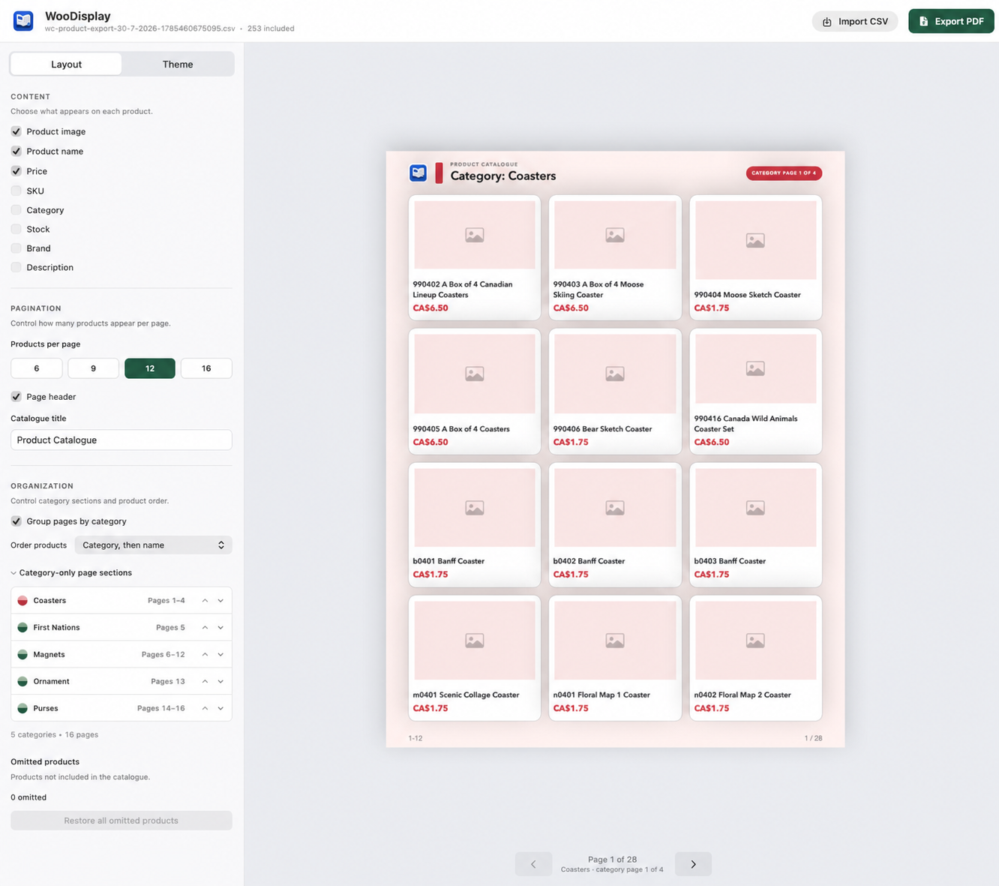

  

<h1 align="center">WooDisplay for macOS</h1>

  A compact native catalogue studio for WooCommerce product exports.

  <a href="https://github.com/booooorb/WooDisplay/raw/refs/heads/main/dist/WooDisplay-macOS-universal.zip"><strong>Download WooDisplay for macOS</strong></a>
   
  Universal app for Apple Silicon and Intel Macs · macOS 13 or later

WooDisplay is a compact native macOS studio for turning a WooCommerce product-export CSV into a printable PDF catalogue. Import a WooCommerce export, adjust the layout and theme, then export a print-ready PDF.

## Interface

### Theme settings

Choose from twelve presets, customize catalogue and category colors, change typography, and import or export reusable theme files.

### Layout settings

Choose the product information shown, set pagination, organize category-only page sections, and restore omitted products.

## Launch

1. Click **Download WooDisplay for macOS** above.
2. Open `WooDisplay-macOS-universal.zip` from Downloads.
3. Drag **WooDisplay.app** into Applications if you want to keep it there.
4. Control-click **WooDisplay.app**, choose **Open**, then confirm **Open**.
5. Click **Import CSV** and choose your WooCommerce product export.

The Control-click step is required only for the first launch because this downloadable build is ad-hoc signed rather than Apple-notarized. The public download intentionally contains no private CSV files or generated catalogues.

WooDisplay can install updates without an administrator prompt when the app is kept in a user-writable folder such as `~/Applications`. A copy in a protected system Applications folder may require macOS authorization. Eliminating the first-open security confirmation for downloaded builds requires a Developer ID-signed and Apple-notarized release.

## Features

- Shows published WooCommerce products and combines product variations into their parent product
- Live US Letter preview of the PDF output
- Starts with only product image, product name, and price
- Optional SKU, category, stock, brand, and description fields
- Category-grouped page sections with live page ranges and manual category ordering
- Explicit `Category: …` page titles and category-page numbering in preview and PDF
- Independent accent, page, text, price, card, and image colors for every category
- Product ordering by category, name, or price
- Click any preview product to omit it, with individual or bulk restore controls
- Adjustable 6, 9, 12, or 16 products per page
- Separate **Layout**, **Filters**, and **Theme** inspector modes for a cleaner workflow
- Catalogue-wide brand, category, price, stock-quantity, and out-of-stock filters applied before pagination and PDF export
- Native macOS light and dark appearance support for the application interface
- Twelve preset designs: Studio, Editorial, Poster, Gallery, Nordic, Midnight, Terracotta, Mono, Coastal, Lavender, Espresso, and Citrus
- Thirteen font choices
- Custom accent, page, text, price, card, and image-background colors
- Import and export reusable JSON theme settings, including category palettes
- Adjustable alignment, image fit, card corners, borders, and spacing
- Optional company logo upload with adjustable sizing for catalogue page headers; catalogues have no logo by default
- Custom seller company, contact, website, email, and phone details with automatic footer text fitting
- Import another WooCommerce CSV from inside the app
- Export the previewed design as a printable PDF catalogue
- Checks GitHub for a newer build at launch, with a manual **Check for Updates…** command in the app menu

## Create a printable catalogue

Adjust the content, density, theme, colors, and font in the inspector. The large page preview updates immediately. Click **Export PDF**, choose a destination, and the app creates the complete catalogue using the same layout.

## Rebuild

Double-click **Build WooDisplay.command** after changing the source or replacing the CSV. The script compiles a release build and recreates **WooDisplay.app**.

The bundled app is universal for Apple Silicon and Intel Macs and requires macOS 13 or later. Rebuilding requires Apple Command Line Tools with Swift.
